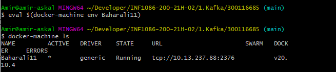
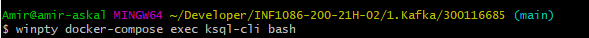
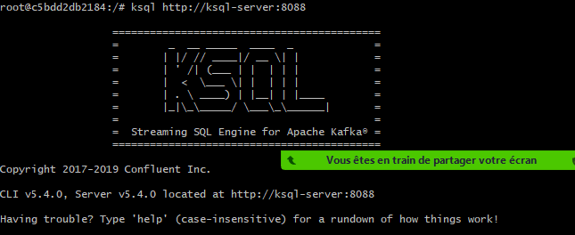
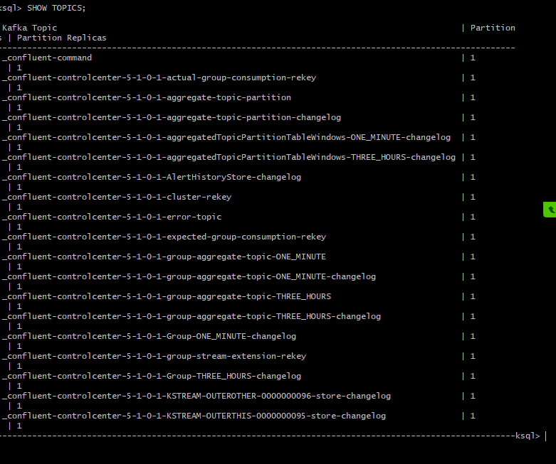
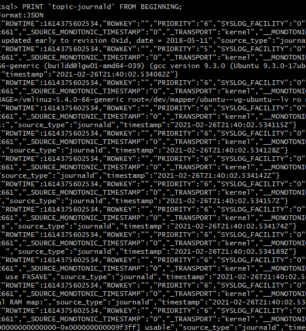
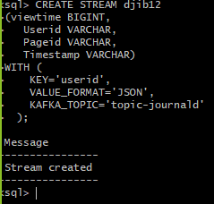
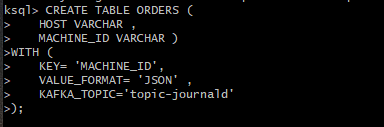

# :bookmark: Objectif est de creer un stream et un table en KSQL

:one: Docker machine:tu dois acceder a le docker qui est installe dans votre server linux 
-----------------------------------------------------------------------

:two: se connecter au container
--------------------------------

:three: Éxécuter le CLI ksql
-----------------------------

:four: SHOW TOPICS
------------------

:five: topic-journald
----------------------

:six: creer un STREAM 
----------------------

:seven: creer un table 
----------------------

