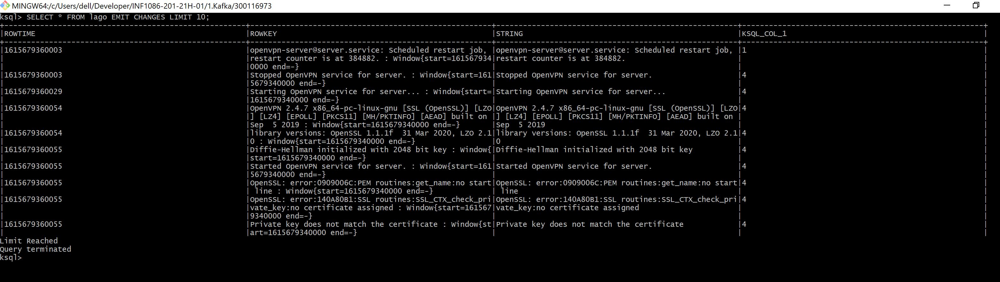

# :smile:Requette ksql du stream NATHY et de la table lago :smile:

La table que nous avons creer permet de compter le nombre de fois que le message apparait en 30 secondes. Le group by permet de creer automatique les cles. Alors la requete permet de de mettre en evidence cela. Vous le trouverez ci-dessous.

``` 
SELECT * FROM NATHY EMIT CHANGES LIMIT 10;
SELECT * FROM lago EMIT CHANGES LIMIT 10;
```



