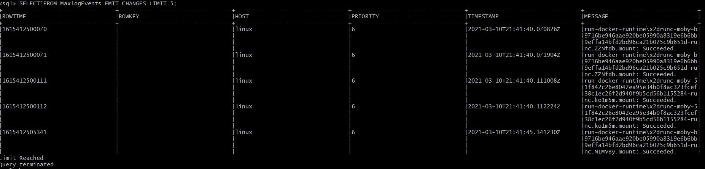

## :rocket: STREAM AND TABLE

## :one: tout d'abord on creer un premier stream
```
CREATE STREAM logEvents(host string, PRIORITY int, timestamp string, message string)
WITH (kafka_topic='topic-journald',value_format='json');

```

### notre stream affiche **host** , **la priorite**, **le timestramp** ,**le message** de notre topic d'evenements

## :two: on cree notre deuxieme stream a partir du 1er

```
CREATE STREAM MaxlogEvents
AS SELECT * FROM logEvents
WHERE PRIORITY>=6 ;
```
### notre stream affiche les evenements donc la **priorite superieure** ou **egale a 6**


## :three: creation de notre table a partir de notre 1 stream

```CREATE TABLE message_counts
AS SELECT MESSAGE,COUNT(*)
AS Total_messages
FROM logEvents WINDOW TUMBLING(SIZE 1 MINUTE)
GROUP BY MESSAGE;

```
### affiche et compte les message chaque 1 minute
