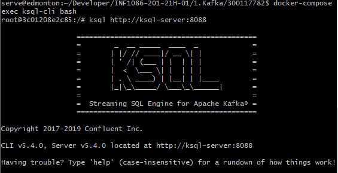
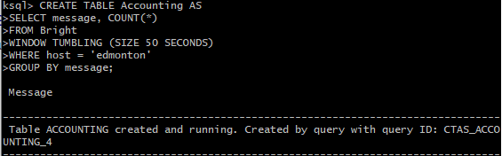
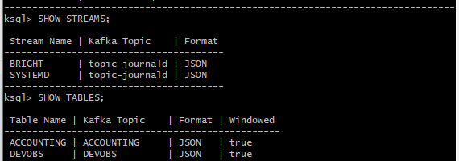
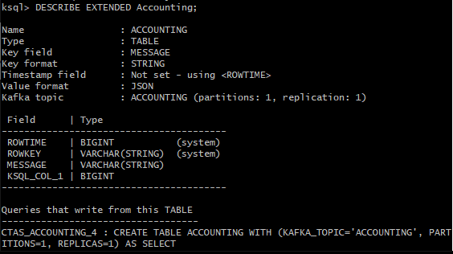

# :cherry_blossom:Creation de STREAM et de la TABLES KSQL :cherry_blossom:

## Le but de cet exercice, est de installez KSQL sur notre serveur Linux et ensuite exécutez DB Kafka.

## :mag: Creation des tables

## :mag: Affichage des tables pour etre sur quelle ont ete creer
       

## :mag: DESCRIBE EXTENDED Accounting pour avoir plus de detaille de la table

