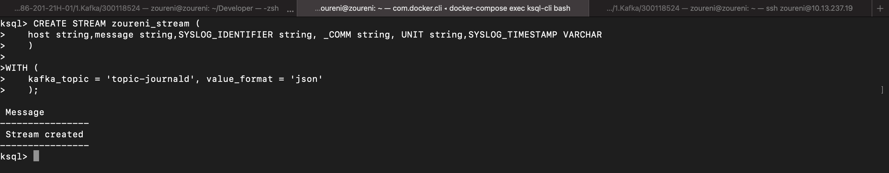
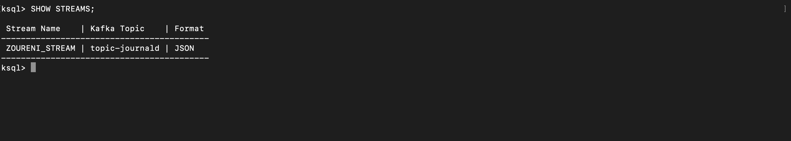
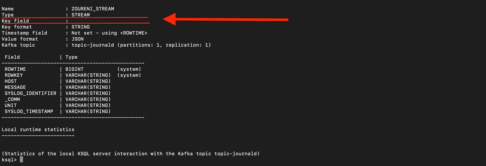
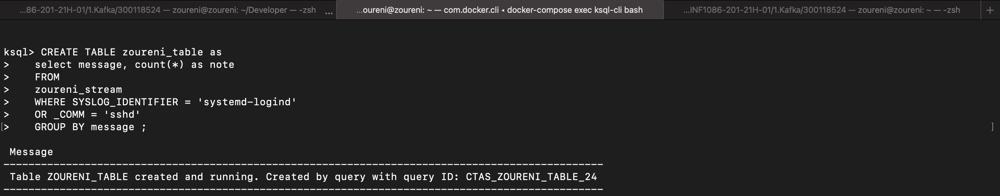
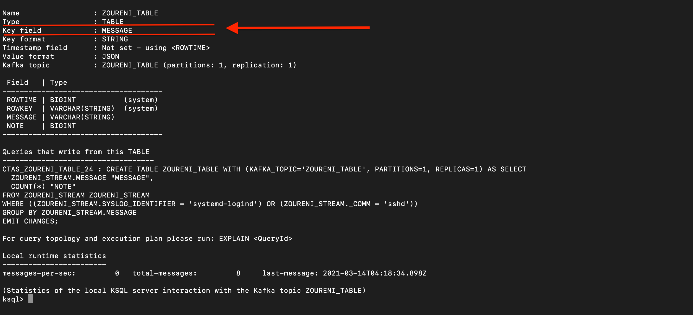
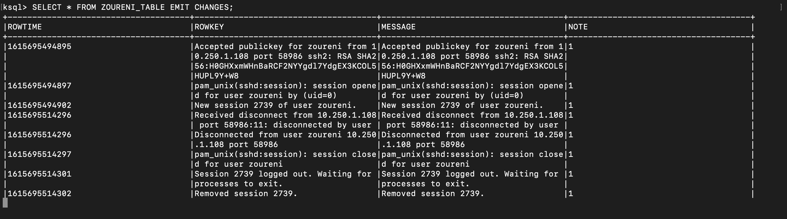

# STREAM ET TABLE :hotsprings:

## :one: CREATION DU STREAM NOMMÉ `ZOURENI_STREAM`


```
```

AFFICHONS NOS STREAMS CRÉÉS :page_facing_up:


```
```

IMPRIMONS LES DÉTAILS DE NOTRE STREAM :page_with_curl:

:heavy_exclamation_mark: REMARQUE : NOTRE STREAM **N’A PAS DE CLÉ** (KEY FIELD)


`~~~~~~~~~~~~~~~~~~~~~~~~~~~~~~~~~~~~~~~~~~~~~~~~~~~~~~~~~~~~~~~~~~~~~~`
```
```

## :two: CREATION DE LA TABLE 

- QUI CAPTURE LES MESSAGES :incoming_envelope: :
   - OUVERTURE DE SESSION PAR SSH, DOCKER-MACHINE SSH ET LOCALEMENT
   - FERMETURE DE SESSION


```
```

IMPRIMONS LES DÉTAILS DE NOTRE TABLE :page_with_curl:

:rotating_light: REMARQUE : NOTRE TABLE A UNE **CLÉ (KEY FIELD)** :key: QUI EST `MESSAGE`


```
```
EXEMPLE DES RESULTATS QUI SERONT IMPRIMÉS DANS LA TABLE :clipboard:


