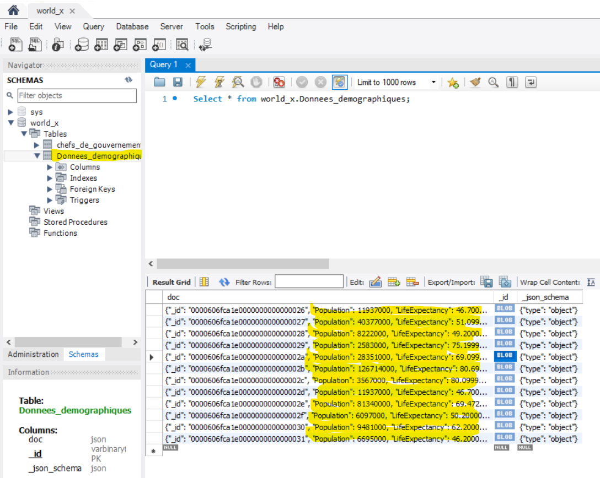

# 💡Programmation MySQLsh en Python 🐍

Salut, 

Dans ce tutoriel, Je vais créer un programme utilisant les API MySQL X Dev en Python 🐍
Après avoir installé Python, GIt et docker desktop, suivez les étapes suivantes : 

## :a:  Installer MySQL Server 📍
#### :one:  Créeation du conteneur some-mysqlds

```
(base) PS C:\Users\akram fadde> docker container run `
         --name some-mysqlds `
         --env MYSQL_ROOT_PASSWORD=password `
         --publish 3306:3306 `
         --publish 33060:33060 `
         --detach `
         mysql/mysql-server:latest
e50b9a561ed0e7809ec928d333ecd7e11220f4b00de417ae6cc1bfd3de219ddb
```

#### :two: Créeation de la base de données world_x
```
(base) PS C:\Users\akram fadde> docker container exec --interactive some-mysqlds mysql `
>>                         --user root --password=password `
>>                         --execute "CREATE DATABASE world_x;"
mysql: [Warning] Using a password on the command line interface can be insecure.

```

#### :three: Création de l'utilisateur root sous le sous-réseau déterminé par le pont Bridge du conteneur Docker 'root'@'172.17.0.1'

```
(base) PS C:\Users\akram fadde> docker container exec --interactive some-mysqlds `
>>                 mysql --user root --password=password `
>>                 --execute "CREATE USER 'root'@'172.17.0.1' IDENTIFIED BY 'password';"
mysql: [Warning] Using a password on the command line interface can be insecure.

```

#### :four: Donner tous les droits d'accès à n'importe quelle base de données:

```
(base) PS C:\Users\akram fadde> docker container exec --interactive some-mysqlds `
>>                 mysql --user root --password=password `
>>                 --execute "GRANT ALL ON *.* TO 'root'@'172.17.0.1';"
mysql: [Warning] Using a password on the command line interface can be insecure.

```

## :ab: X DevAPI en Python 🐍

#### :one: Installer MySQL Connector Python avec pip

```
(base) PS C:\Users\akram fadde> pip install mysql-connector-python
Collecting mysql-connector-python
  Downloading mysql_connector_python-8.0.23-cp38-cp38-win_amd64.whl (854 kB)
     |████████████████████████████████| 854 kB 6.4 MB/s
Collecting protobuf>=3.0.0
  Downloading protobuf-3.15.8-py2.py3-none-any.whl (173 kB)
     |████████████████████████████████| 173 kB 3.3 MB/s
Requirement already satisfied: six>=1.9 in c:\tools\anaconda3\lib\site-packages (from protobuf>=3.0.0->mysql-connector-python) (1.15.0)
Installing collected packages: protobuf, mysql-connector-python
Successfully installed mysql-connector-python-8.0.23 protobuf-3.15.8

```

#### :two: Vérifier l'installaiton du connecteur MySQL

```
(base) PS C:\Users\akram fadde> pip show mysql-connector-python
Name: mysql-connector-python
Version: 8.0.23
Summary: MySQL driver written in Python
Home-page: http://dev.mysql.com/doc/connector-python/en/index.html
Author: Oracle and/or its affiliates
Author-email:
License: GNU GPLv2 (with FOSS License Exception)
Location: c:\tools\anaconda3\lib\site-packages
Requires: protobuf

```

## 🔤 Modifier le programme Python "b300115065.py"

 Modifier le programme Python en ajoutant les fonction suivantes:
 
###### 📍 Utilisation de variable 'session' et 'db'
###### 📍 Déclaration de la fonction 'lecture'
###### 📍 créeation d'une fonction 'former_des_chefs()'
 
 ## 🔡 Ammelioration ✨
 
 ##### 💡 Ajouter une autre collection manuellement nommée 'Donnees_demographiques'
 
 

 
🐍
