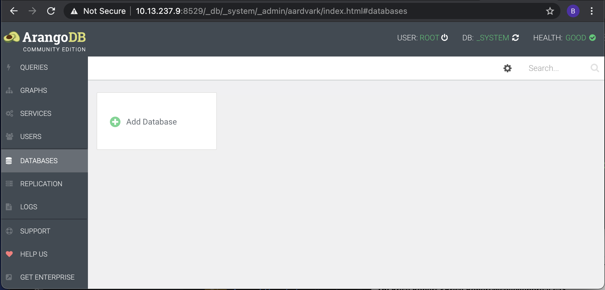

# ArangoDB


</img>


## :a: Démarrer la basee de données

https://www.arangodb.com/download-major/docker/

```
$ docker run --name some-arangodb --publish 8529:8529 --env ARANGO_ROOT_PASSWORD=openSesame --detach arangodb/arangodb:3.7.6
```

## :b: Web Interface

https://www.arangodb.com/docs/stable/getting-started-web-interface.html

http://10.13.237.x:8529

```
User: root
Password: openSesame
```




## :ab: CLI

https://www.arangodb.com/docs/3.7/programs.html

```
$ docker container exec --interactive --tty some-arangodb arangosh
Please specify a password: 

                                       _     
  __ _ _ __ __ _ _ __   __ _  ___  ___| |__  
 / _` | '__/ _` | '_ \ / _` |/ _ \/ __| '_ \ 
| (_| | | | (_| | | | | (_| | (_) \__ \ | | |
 \__,_|_|  \__,_|_| |_|\__, |\___/|___/_| |_|
                       |___/                 

arangosh (ArangoDB 3.7.6 [linux] 64bit, using jemalloc, build tags/v3.7.6-0-g780ac0e127, VPack 0.1.33, RocksDB 6.8.0, ICU 64.2, V8 7.9.317, OpenSSL 1.1.1i  8 Dec 2020)
Copyright (c) ArangoDB GmbH

Command-line history will be persisted when the shell is exited. You can use `--console.history false` to turn this off
Connected to ArangoDB 'http+tcp://127.0.0.1:8529, version: 3.7.6 [SINGLE, server], database: '_system', username: 'root'

Type 'tutorial' for a tutorial or 'help' to see common examples
127.0.0.1:8529@_system>
```
