# Architecture

:o: Prérequis

Installation de la [VM](VM) - Serveur Local et Azure

## Kafka Theory

https://www.linkedin.com/learning/learn-apache-kafka-for-beginners/kafka-theory-overview?u=56968449

## Realtime

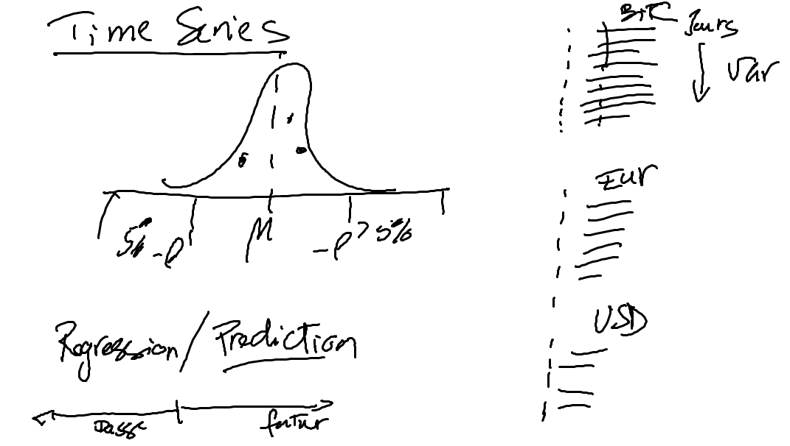

## DB Types

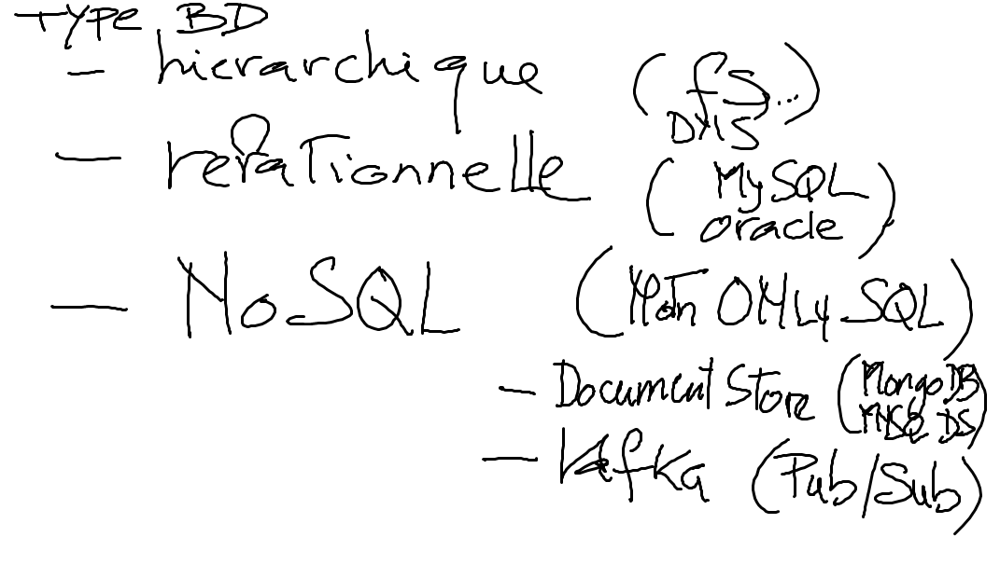

## Req/Res (Request and Respond - web) vs Pub/Sub (publish and subscribe - Kafka)

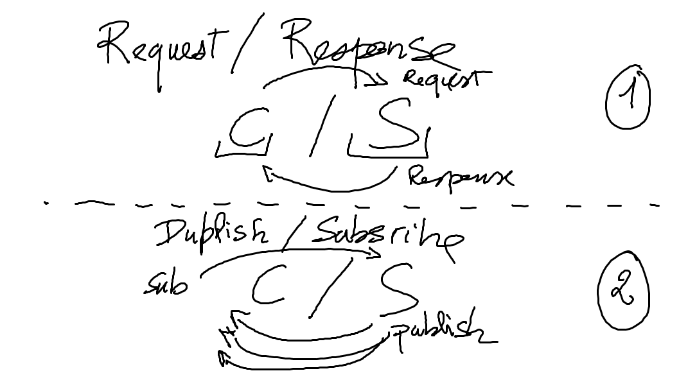

## Kafka Architecture

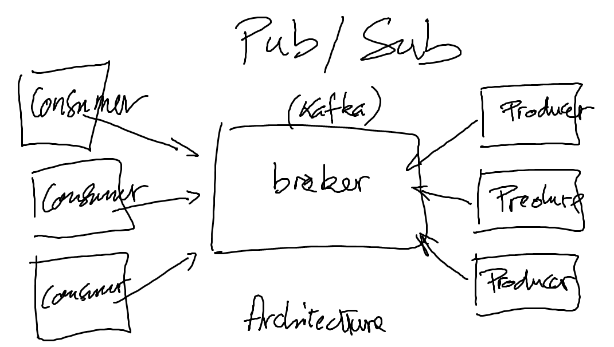

## Kafka Cluster

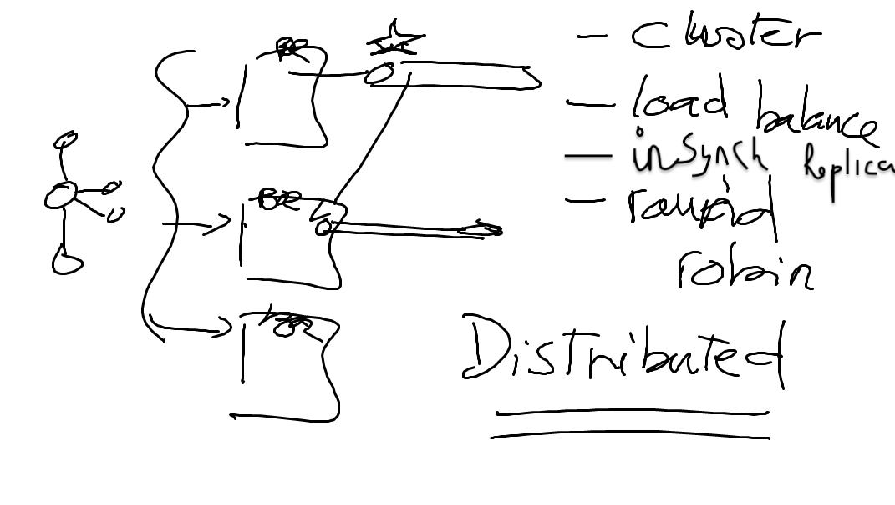

## Kafka Patterns

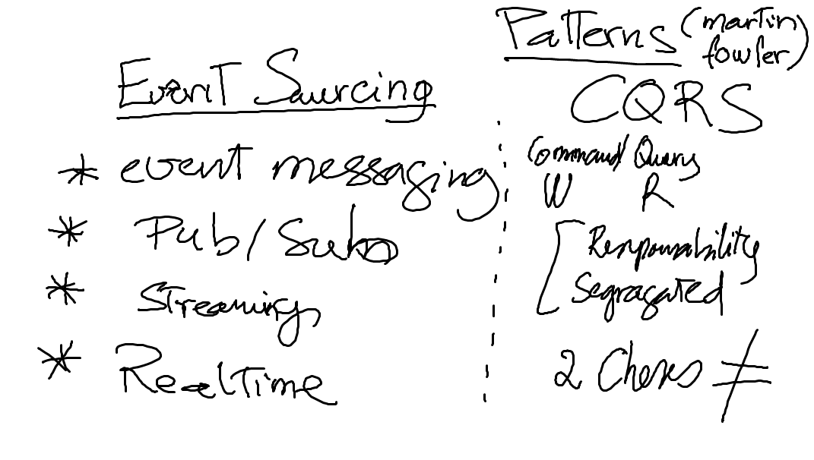

# Composants de Base 

## Equivalent d'un Message Broker

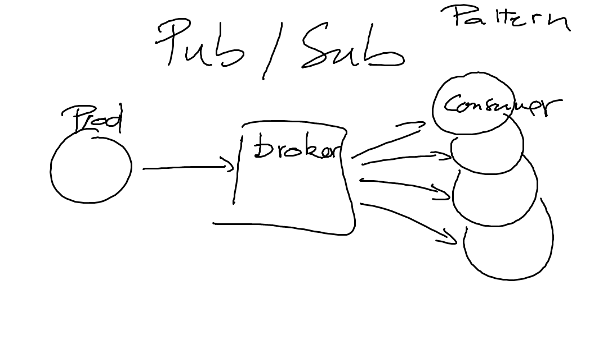

## Géré en grappes (Cluster)

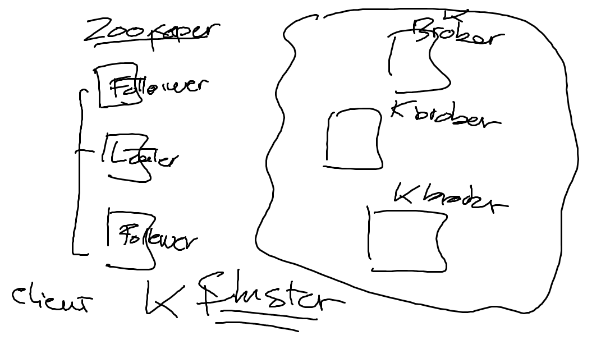

## Achitecture résiliente (Distributed) et élastique (Scalability)

## Les Topics peuvent etre vu comme une table

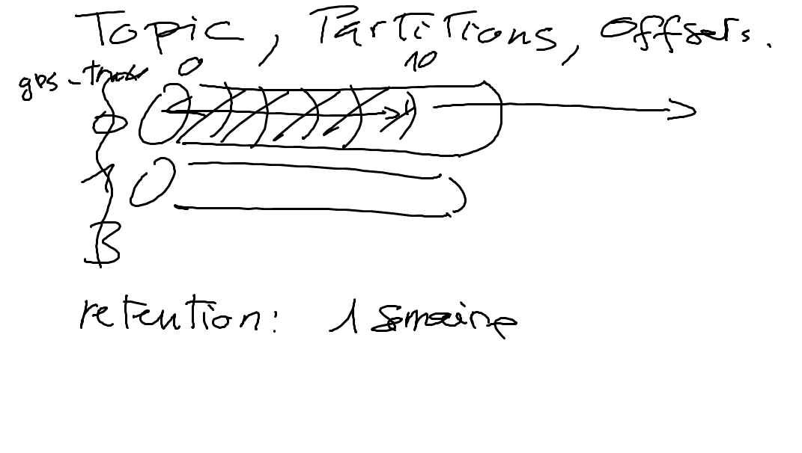

## Les topics peuvent etre lus en groupes

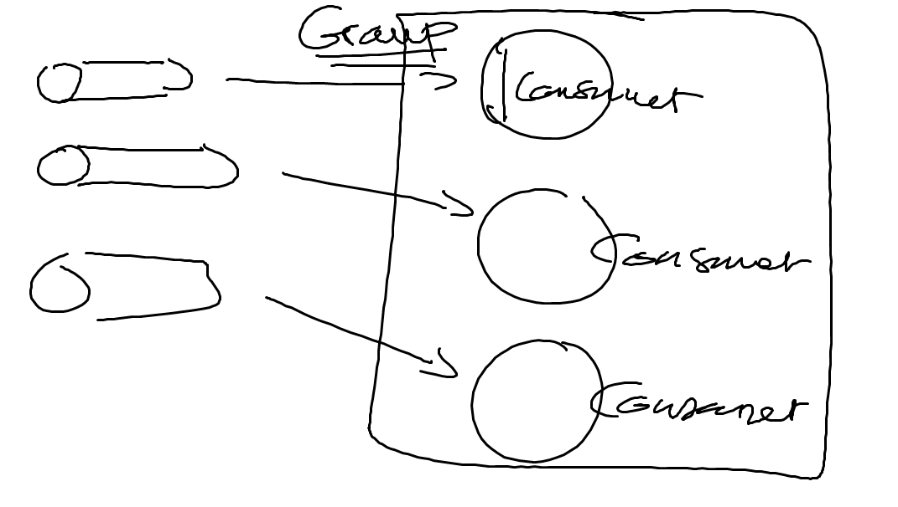

## Les messages sont appellé `offsets` et contenu dans des fichier logs

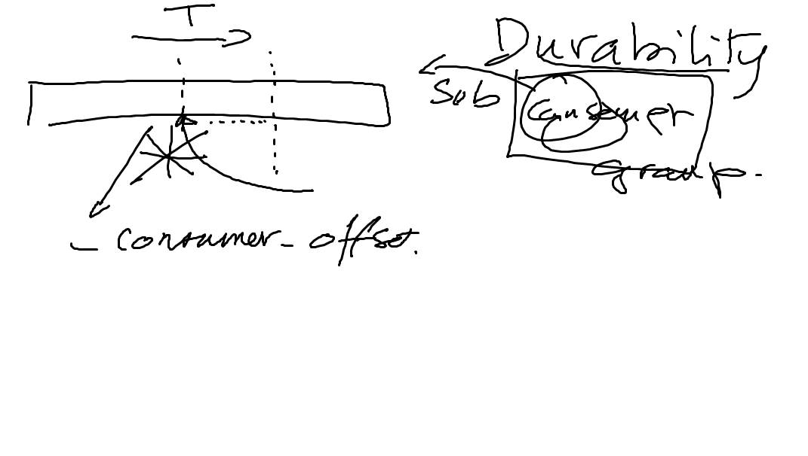
