# 🐝: MongoDB 
------
## MongoDB est une base de données de documents conçue pour faciliter le développement et la mise à l'échelle. Elle propose à la fois une version communautaire et une version Entreprise de la base de données.
------
# 💻: :one: Step to Install MongoDB from Docker
```
docker pull mongo

```
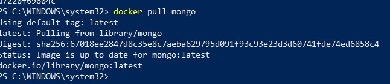

```
docker run --name mongodb -p 27017:27017 mongo

```
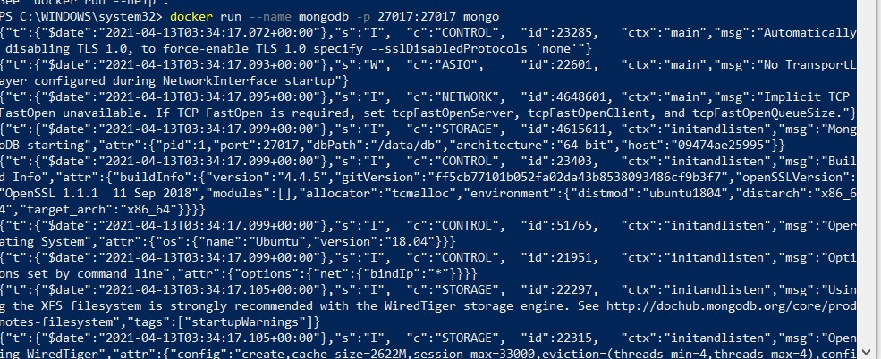

```
docker exec -it mongodb bash

```
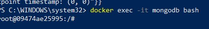

```
mongo

```
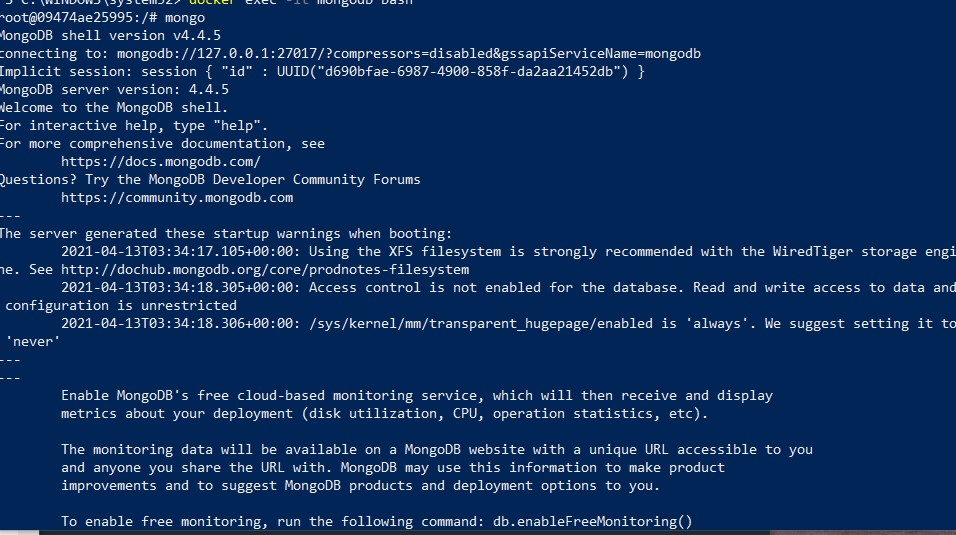

```
show dbs

```
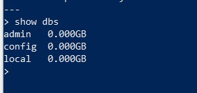

```
use luxuryy

```
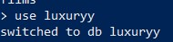

----
## :pushpin: :two: Test insert data (example data add data to inventory collection )
```
db.inventory.insertMany([
   { item: "journal", qty: 25, status: "A", size: { h: 14, w: 21, uom: "cm" }, tags: [ "blank", "red" ] },
   { item: "notebook", qty: 50, status: "A", size: { h: 8.5, w: 11, uom: "in" }, tags: [ "red", "blank" ] },
   { item: "paper", qty: 10, status: "D", size: { h: 8.5, w: 11, uom: "in" }, tags: [ "red", "blank", "plain" ] },
   { item: "planner", qty: 0, status: "D", size: { h: 22.85, w: 30, uom: "cm" }, tags: [ "blank", "red" ] },
   { item: "postcard", qty: 45, status: "A", size: { h: 10, w: 15.25, uom: "cm" }, tags: [ "blue" ] }
]);

```
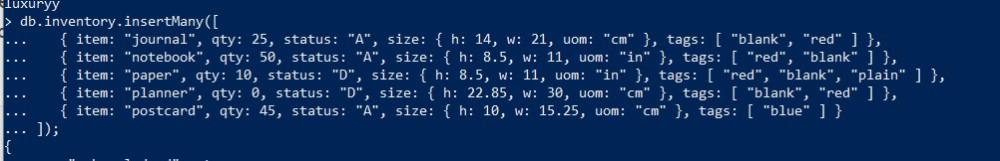


## L'opération renvoie un document qui contient l'indicateur d'accusé de réception et un tableau qui contient le _idde chaque document inséré avec succès


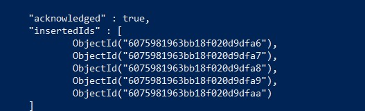


## :pushpin:  Pour renvoyer tous les documents de la inventory collection.
```
db.inventory.find({})
```


## :pushpin:  Pour mettre en forme les résultats, ajoutez le .pretty()à l' fin d'opération.
```
db.inventory.find({}).pretty()

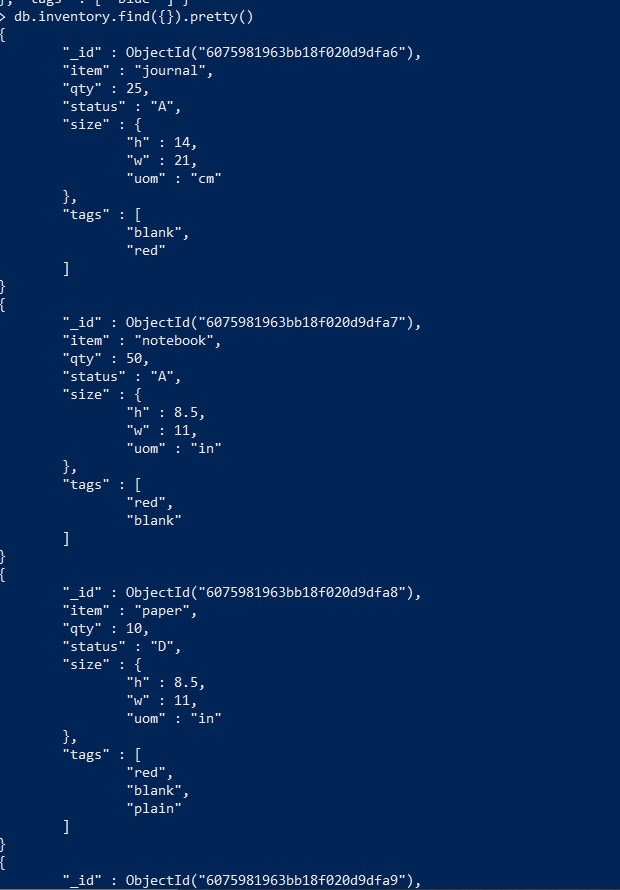
```
## :pushpin:  Pour renvoyer les documents où le statuschamp est égal "D"
```
db.inventory.find( { status: "D" } );

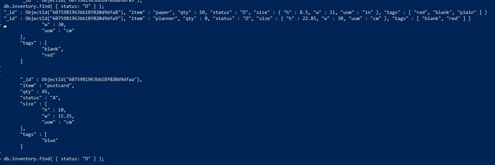
```

## :pushpin:  Pour renvoyer le document où le qtychamp est égal 0:
```
db.inventory.find( { qty: 0 } );
```
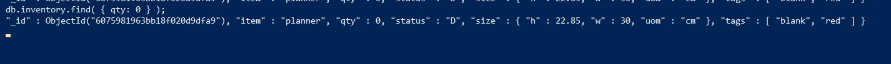
```
```
## :pushpin:  Pour renvoyer le document où le qtychamp est égal 0et le statuschamp est égal "D"
```
db.inventory.find( { qty: 0, status: "D" } );
```
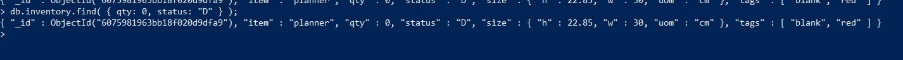
```
