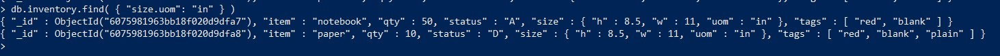
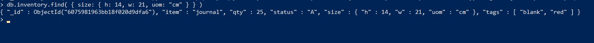
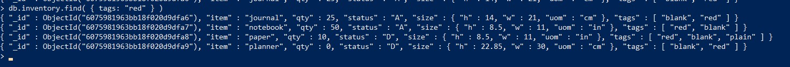
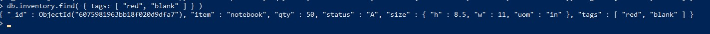
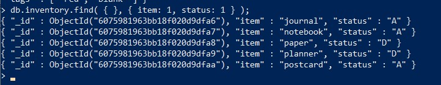
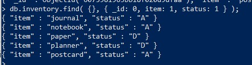

# 🐝: MongoDB 


------
## MongoDB est une base de données de documents conçue pour faciliter le développement et la mise à l'échelle. Elle propose à la fois une version communautaire et une version Entreprise de la base de données.
------
# 💻: :one: Step to Install MongoDB from Docker

## :snake: Telecharge l'image MongoDB sur Docker Hub
```
docker pull mongo

```

## L'execution de l'image
```
docker run --name mongodb -p 27017:27017 mongo

```


## :snake: Pour entrer dans le container 
```
docker exec -it mongodb bash

```


## :apple: Pour entrer dans MongoDB
```
mongo

```


## :computer: Pour afficher les bases de donnees 
```
show dbs

```


## :apple: Pour creer les bases de donnees
```
use luxuryy

```


----
## :pushpin: :two: Pour l'insertion d'une collection 
```
db.inventory.insertMany([
   { item: "journal", qty: 25, status: "A", size: { h: 14, w: 21, uom: "cm" }, tags: [ "blank", "red" ] },
   { item: "notebook", qty: 50, status: "A", size: { h: 8.5, w: 11, uom: "in" }, tags: [ "red", "blank" ] },
   { item: "paper", qty: 10, status: "D", size: { h: 8.5, w: 11, uom: "in" }, tags: [ "red", "blank", "plain" ] },
   { item: "planner", qty: 0, status: "D", size: { h: 22.85, w: 30, uom: "cm" }, tags: [ "blank", "red" ] },
   { item: "postcard", qty: 45, status: "A", size: { h: 10, w: 15.25, uom: "cm" }, tags: [ "blue" ] }
]);

```


## L'opération renvoie un document qui contient l'indicateur d'accusé de réception et un tableau qui contient le _idde chaque document inséré avec succès


## :pushpin:  Pour renvoyer tous les documents de la inventory collection.
```
db.inventory.find({})
```


## :pushpin:  Pour mettre en forme les résultats, ajoutez le .pretty()à l' fin d'opération.
```
db.inventory.find({}).pretty()
```


## :pushpin:  Pour renvoyer les documents où le statuschamp est égal "D"
```
db.inventory.find( { status: "D" } );
```


## :pushpin:  Pour renvoyer le document où le qtychamp est égal 0:
```
db.inventory.find( { qty: 0 } );
```


## :pushpin:  Pour renvoyer le document où le qtychamp est égal 0et le statuschamp est égal "D"
```
db.inventory.find( { qty: 0, status: "D" } );
```


## :pushpin:  Pour  rrenvoyer le document où le uomchamp, imbriqué dans le document de taille, est égal à "in"
```
db.inventory.find( { "size.uom": "in" } )
```



## :pushpin:  Pour  renvoyer le document où le sizechamp est égal au document { h: 14, w: 21, uom: "cm" }
```
db.inventory.find( { size: { h: 14, w: 21, uom: "cm" } } )
```



## :pushpin:  Pour renvoyer les documents dans lesquels le tagstableau contient "red"comme l'un de ses éléments
```
db.inventory.find( { tags: "red" } )
```



`
## :pushpin:  Pourenvoyer les documents où le tagschamp correspond exactement au tableau spécifié, y compris l'ordre
```
db.inventory.find( { tags: [ "red", "blank" ] } )
```



## :pushpin:  Pour retourner le _id, itemet les status champs de tous les documents de la inventorycollec
```
db.inventory.find( { tags: [ "red", "blank" ] } )
```



## :pushpin:  Il n'est pas nécessaire de spécifier le _idchamp pour renvoyer le champ. Il retourne par défaut. Pour exclure le champ, définissez-le sur 0dans le document de projection. Par exemple, pour ne renvoyer que itemles status champs et les champs des documents correspondants:
```
db.inventory.find( {}, { _id: 0, item: 1, status: 1 } );
```



## :pushpin: References:
```
https://www.mongodb.com/basics/examples
https://phumipatc.medium.com/how-to-install-mongodb-to-docker-f17cec2b1f8f
```

