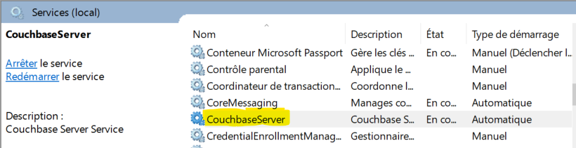
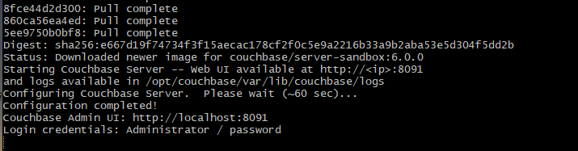
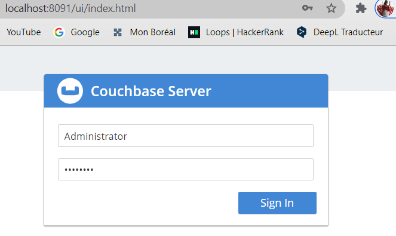
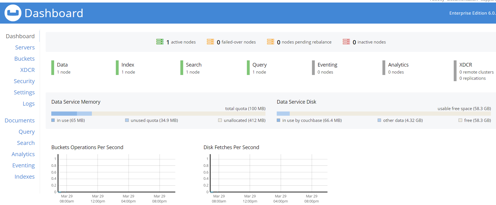
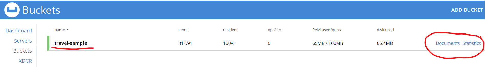
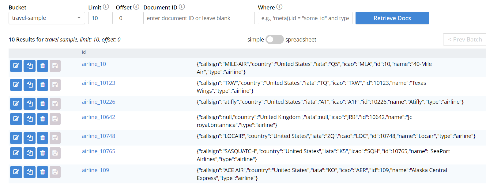
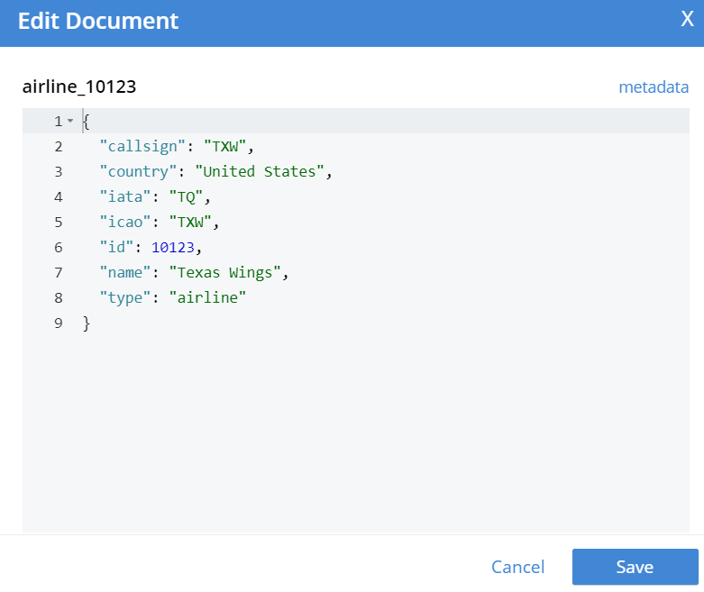
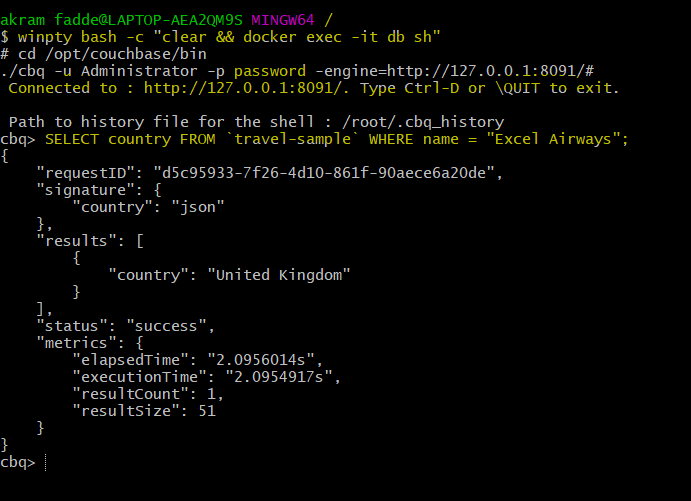
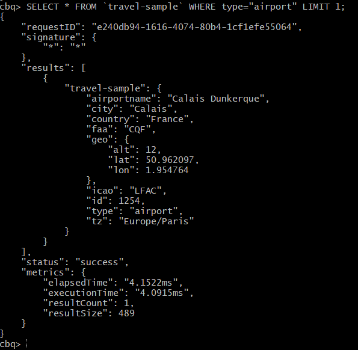
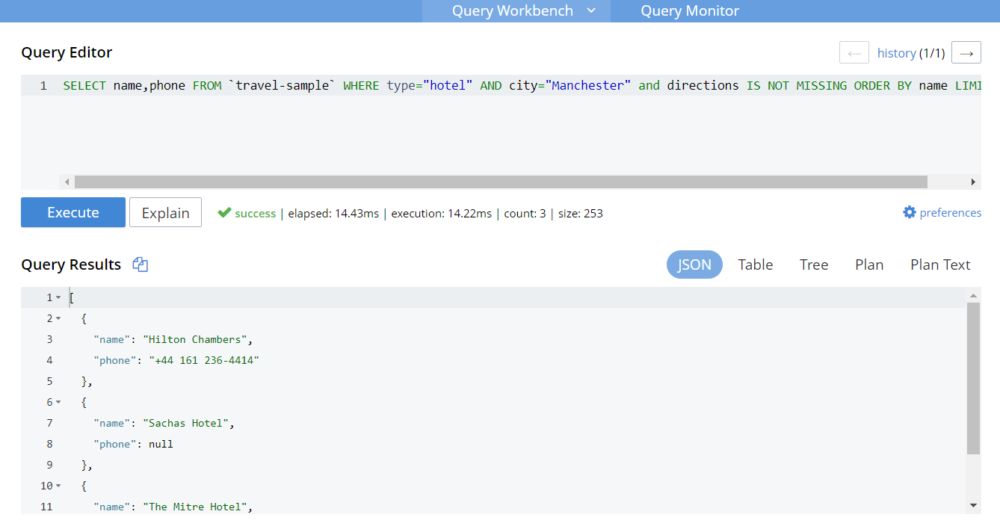

# 📌 Install Couchbase server 6.0 community/entreprise on Windows

💡 Couchbase Server community/entreprise

```
The open source foundation of NoSQL Couchbase data platform is available free of charge for both development and production, and supported by the Couchbase community/entreprise forum.
Best suited for developers when basic education, availability, performance, tooling, and query is sufficient
```

## :one: install Couchbase Server using the command line

### 📍 Download the appropriate package from the Couchbase download page

```
https://packages.couchbase.com/releases/7.0.0-beta/couchbase-server-community_7.0.0-beta-windows_amd64.msi
```
### 📍 Install Couchbase Server

```
start /wait msiexec /i couchbase.msi /qn
```


## 📌 Using Docker 

###### With a single command, download and install a pre-configured version of Couchbase Server Enterprise Edition

```
docker run -t --name db -p 8091-8094:8091-8094 -p 11210:11210 couchbase/server-sandbox:6.0.0
```


## :one: Access the Console and Log In



## :two: Examine the Cluster Dashboard



## :three: Examine the Bucket and Its Documents



###### All documents that are contained within the bucket 'travel-sample':



##### 💡 example of json doc: airline_10123



## 📌 Run a N1QL Query

##### :one: run the interactive query shell

```
bash -c "clear && docker exec -it db sh"
```
##### :two: navigate to the Couchbase bin directory, and start cbq:

###### 💡 PS: cbq is a comprehensive command line shell for N1QL that enables to query and update data from Couchbase Server.

```
cd /opt/couchbase/bin
./cbq -u Administrator -p password -engine=http://127.0.0.1:8091/
```
###### Here’s some example of a N1QL queries:

```
SELECT country FROM `travel-sample` WHERE name = "Excel Airways";
```



```
cbq> SELECT * FROM `travel-sample` WHERE type="airport" LIMIT 1;
```



## 📌 Try on the Query Workbench

```
SELECT name,phone FROM `travel-sample` WHERE type="hotel" AND city="Manchester" and directions IS NOT MISSING ORDER BY name LIMIT 10;
```




✨
