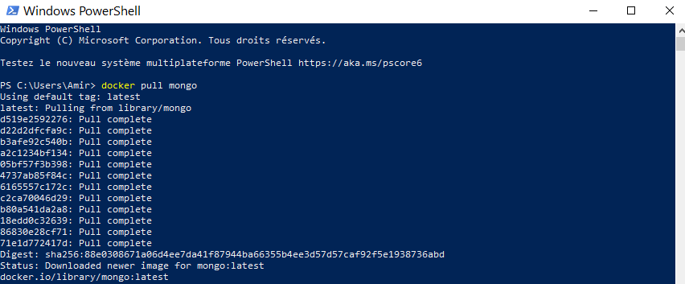
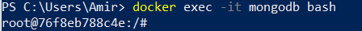
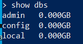
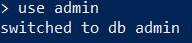
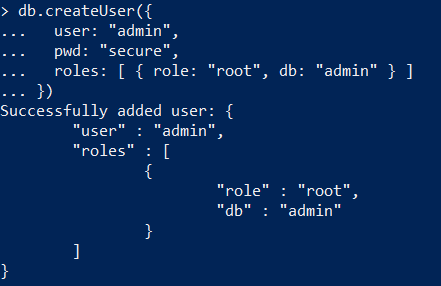

# :bookmark:Projet : installer mongodb sur Docker 
## :trollface: je vous expose comment installer mongodb sur docker a l'aide de POWERSHELL 

Mongodb est système de gestion de base de données orienté documents, répartissable sur un nombre quelconque d'ordinateurs et ne nécessitant pas de schéma prédéfini des données

1️⃣  installer mongodb
---------------------
```
docker pull mongo
```


2️⃣ execute le contrainer 
------------------------
```
docker run --name mongodb -p 27017:27017 mongo
```

pour sortir appuyez la touche CTRL+C

3️⃣ bash au contrainer pour l'utilisateur 
-----------------------------------------
```
docker exec -it mongodb bash
```


4️⃣ aller a la gestion de mongo 
-------------------------------
```
mongo
```


5️⃣ show db pour utiliser db
----------------------------
```
show dbs
```


6️⃣ utilisez db pour creer un utilisateur
-----------------------------------------
```
use admin 
```


7️⃣ creer un utilisateur et un mot de passe
-------------------------------------------
```
db.createUser({
  user: "admin", 
  pwd: "secure", 
  roles: [ { role: "root", db: "admin" } ]
})
```


8️⃣  Insere des donnees 
-----------------------
```
db.inventory.insertOne ( 
   {"item": "canvas", 
     "qty": 100, 
     "tags": ["cotton"], 
     "size": {"h": 28, "w": 35.5, "uom ":" cm "} 
   } 
)
```


:label: voila les commandes qui permet creer merci 

:link:pour  telecharger mongodb cliquer ce lien en dessous 
https://www.mongodb.com/try/download/compass?tck=docs_compass :fake:
