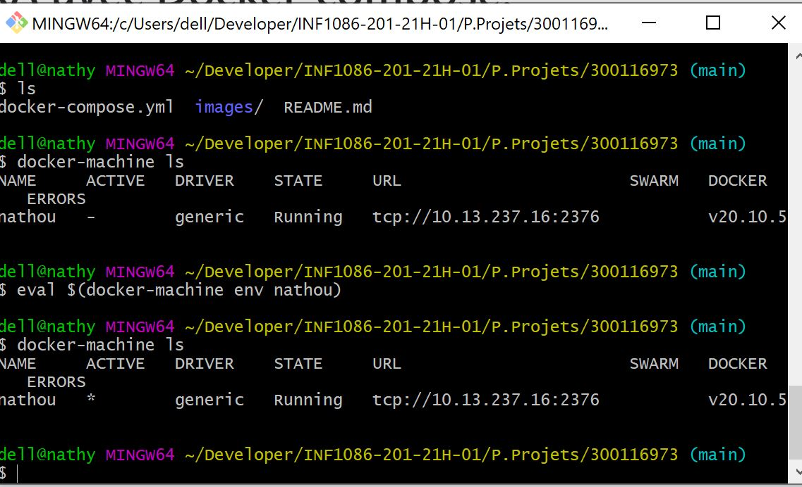
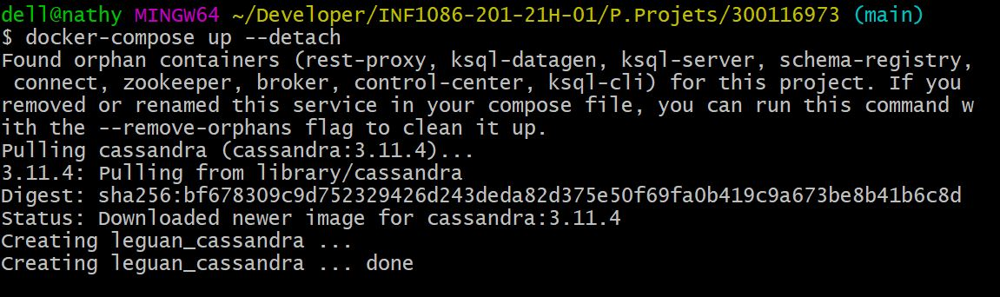
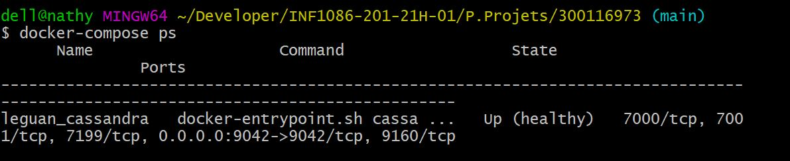
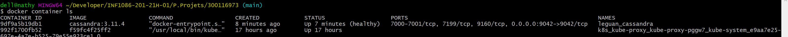
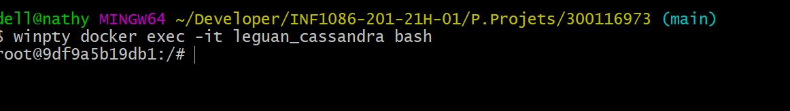
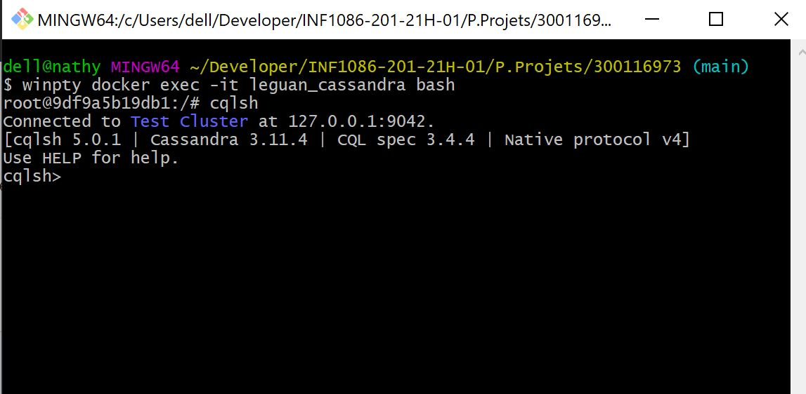
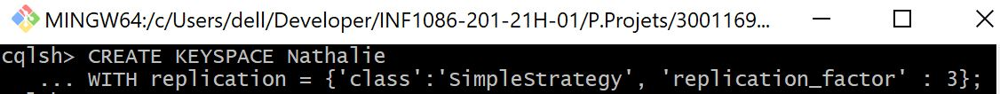
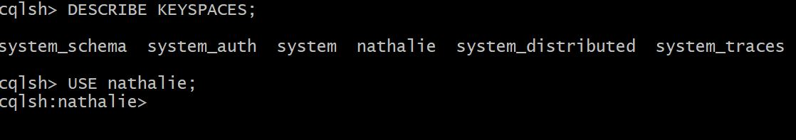
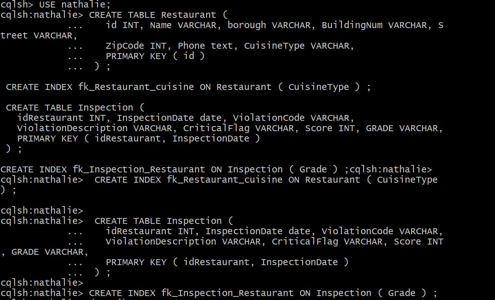
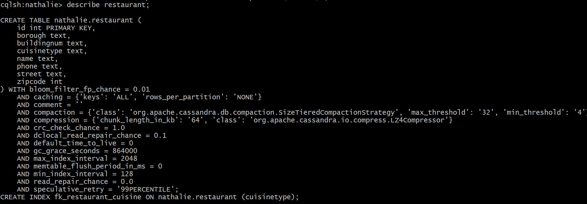

# Installer Apache CASSANDRA avec Docker-compose.


🛩️ Apache Cassandra est une base de donnee NoSQL qui permet le stockage et le traitement de tres grand volumes des donnees. Il est open source et est utilise par plusieurs entreprise.

☑️Dans notre cas nous allons l'installer avec un Docker-compose.

Au prealable installer Docker dans votre serveur linux si vous ne l'avez pas encore fait.

Ensuite  creer un fichier docker-compose.yml que vous allez executer avec le terminal de votre choix. Dans notre cas nous utilisont Git bash :

☑️ Pointer vers votre serveur comme l'image ci-dessous:



votre fichier `docker-compose.yml` doit contenir les elements suivant :

```
version: '3'

services:
  cassandra:
    image: "cassandra:3.11.4"
    container_name: leguan_cassandra
    ports:
      - "9042:9042"
    volumes:
      - ./build/cassandra:/var/lib/cassandra
    healthcheck:
      test: ["CMD-SHELL", "[ $$(nodetool statusgossip) = running ]"]
      interval: 10s
      timeout: 5s
      retries: 50
      
```
☑️Executer votre `docker-compose.yml. avec la commande `docker-compose up --detach`


``` 
docker-compose up --detach

```



verifier l'installation de votre `docker-compose`avec la commande `docker-compose ps` ou `docker container ls`





☑️Excecuter votre container cassandra avec la commande 

```
docker exec -it leguan_cassandra bash
```



creer un KEYSAPACE dans cassandra 

☑️Entre dans la base de donnees Cassandra en tapant la commande :

```
cqlsh

```



☑️ Creer votre Workspace Dans notre cas nous avons creer le workspace nathalie

```
CREATE KEYSPACE Nathalie
WITH replication = {'class':'SimpleStrategy', 'replication_factor' : 3};
```


Apres avoir creer notre Workspace nous allons l'utiliser voir exemple ci-dessous.



Puis nous allons creer les deux tables suivante :

```

CREATE TABLE Restaurant (
   id INT, Name VARCHAR, borough VARCHAR, BuildingNum VARCHAR, Street VARCHAR,
   ZipCode INT, Phone text, CuisineType VARCHAR,
   PRIMARY KEY ( id )
 ) ;

 CREATE INDEX fk_Restaurant_cuisine ON Restaurant ( CuisineType ) ;

 CREATE TABLE Inspection (
   idRestaurant INT, InspectionDate date, ViolationCode VARCHAR,
   ViolationDescription VARCHAR, CriticalFlag VARCHAR, Score INT, GRADE VARCHAR,
   PRIMARY KEY ( idRestaurant, InspectionDate )
 ) ;

CREATE INDEX fk_Inspection_Restaurant ON Inspection ( Grade ) ;

```

voir image ci-dessous



Nous pouvons meme decrire la table que vous venons de creer voir l'image ci-dessous



☑️ Apache Cassandra est une tres bonne base de donnee dans l'optique ou il permet aussi de telecharger les tables creer en CSV et de l'utiliser. 
Nous arrivons donc au terme de notre illustration. Nous vous avons explique en generale comment on peut installer Apache cassandra en utilisant un fichier `docker-compose.yml`
Et nous avons illustrer cela en creer un Workspace et deux tables.

Merci tout en esperans que ce documentaire vous sera utilise. Enjoy it. 🙂

References:
http://b3d.bdpedia.fr/cassandra_tp.html
https://stackoverflow.com/questions/54949716/docker-compose-up-with-cassandra-container-does-not-return
