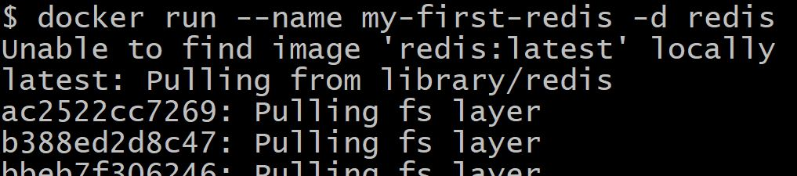
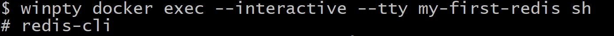
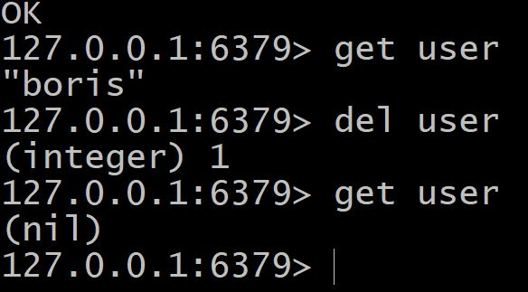
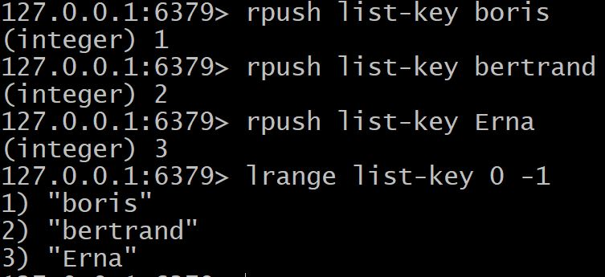

##                                           REDIS
----------------------------------------------------
##  I. What is Redis? 
Redis est une base de données très rapide
non relationnelle qui stocke un mappage de clés vers cinq types de valeurs différents. 
nous avons:
|Structure Type|What it Contain|
|--------------|---------------|
|STRING        |Strings, integers, or floatingpointvalues| 
|LIST          |  Linked list of strings |
|SET           |Unordered collection of unique strings|
|HASH          |Unordered hash table of keys to values|
|ZSET(sorted set)|Ordered mapping of string members to floating-point scores, ordered by score|
##  II. Why Redis? 
votre code est plus court, plus facile à comprendre et plus facile à maintenir, mais il est plus rapide
(car vous n'avez pas besoin de lire une base de données pour mettre à jour vos données).
##  III. Set Redis  With Docker
### :one: Start a redis instance
```
 docker run --name my-first-redis -d redis
```


### :two:Connect with redis with redis-cli
```
 docker exec -it my-first-redis sh
```


## IIII. Test Case
### :one: Commands used on STRING values
|Command        |What is does                                 |
|--------------|----------------------------------------------|
|GET           |Affiche la donnée sauvegarder dans la clé donne| 
|SET           |crée/modifie la valeur enregistrez dans la clé donne |
|DEL           |supprime la valeur de la donnée enregistrez dans la clé donnée|



### :two: Commands used on LISt values
|Command        |What is does                                 |
|--------------|----------------------------------------------|
|RPUSH           |met la valeur à la fin the liste partant de la droite| 
|LRANGE           |affiche une liste de valeur de la liste |
|LINDEX           |affiche la valeur d'un objet a la position indiquer|
|LTOP             |retire et affiche la valeur de la liste partant de la gauche|




