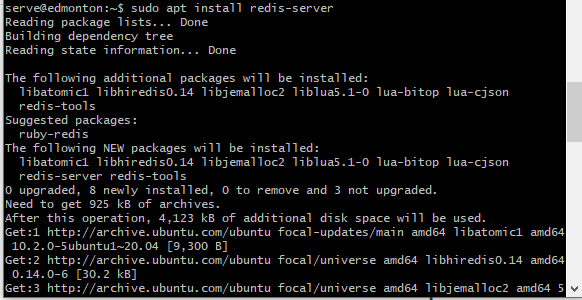
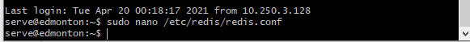
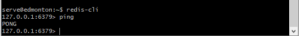
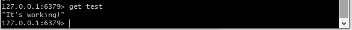
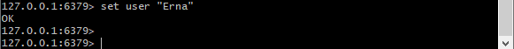
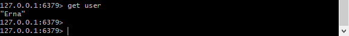

# :ear_of_rice: :rabbit2: Comment installer et sécuriser Redis sur Ubuntu 20.04


# Definition
Redis est une base de données non relationnelle de valeurs-clés en mémoire renomée pour sa flexibilité, ses performances et son vaste support linguistique

## :mag_right: commençons par mettre à jour votre cache local de package `apt`

```
$ sudo apt updat
```

## :mag_right: Installation de Redis

```
$ sudo apt install redis-server
```



Cette opération permettra le téléchargement et l'installation de Redis et de ses dépendances. Suite à cela, nous devons effectuer un changement de configuration important dans le fichier de configuration Redis, qui a été automatiquement généré lors de l'installation

Ouvrons ce nouveau fichier avec notre éditeur de texte

```
$ sudo nano /etc/redis/redis.conf
```


Dans le fichier, il y a la directive supervised. Cette directive  permet de déclarer un système init qui gérera Redis en tant que service et  donnera plus de contrôle sur son fonctionnement. La directive supervised est configurée sur nano par défaut. 
Ensuite, redémarrez le service Redis pour valider les modifications que vous avez apportées au fichier de configuration


## :mag_right: vérifions si le service Redis fonctionne

``` 
$ sudo systemctl status redis
```

 

## :mag_right: Ce connectez au serveur à l'aide de `redis-cli`, le client de la ligne de commande de Redis:

```
$ redis-cli
```

## :mag_right: Dans l'invite qui suit, testons la connectivité avec la commande `ping `




Le résultat `pong` confirme que la connexion au serveur est active

## :mag_right: vérifions que nous pouvons configurer des clés en exécutant les commandes suivantes:

```
set test "It's working!"
```


## :mag_right: Récupérons le resultat en saisissant :

```
get test
```



## :mag_right: Creer un utilisateur :

```
set user "Erna"
```



## :mag_right: Récupérons le resultat en saisissant :

```
get user
```



## :bouquet: Reference

:one: :link: https://redislabs.com/ebook/redis-in-action/

:two: :link: https://linuxize.com/post/how-to-install-and-configure-redis-on-ubuntu-20-04/
