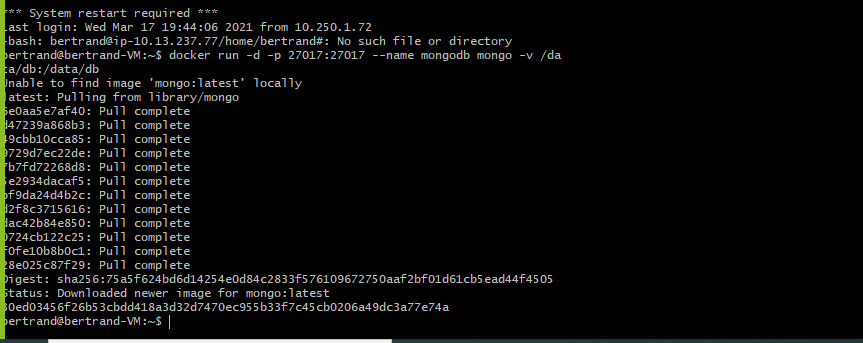
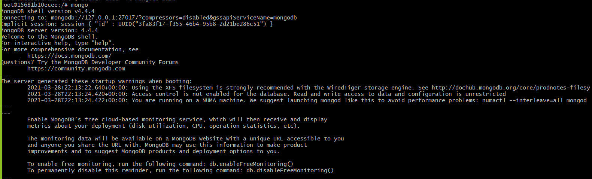
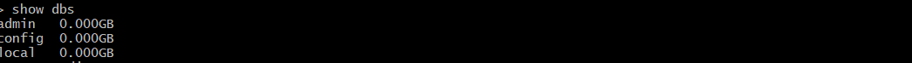
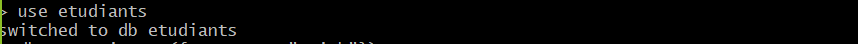
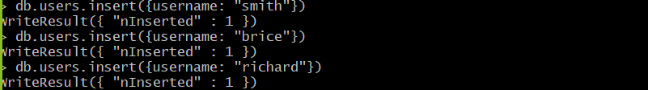
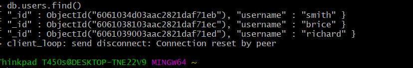

# :rainbow: Installation de Mongodb a partir de Docker 
------
## Dans un système de base de données relationnelles les données sont stockées par ligne dans des tables. Et il est souvent nécessaire de faire des jointures sur plusieurs tables afin de tirer des informations assez pertinentes de la base.
## Dans MongoDB, les données sont modélisées sous forme de document sous un style JSON.
## On ne parle plus de tables, ni d'enregistrements mais de collections et de documents. Ce système de gestion de données nous évite ainsi de faire des jointures de tables car toutes les informations propres à un certain donnée sont stockées dans un même document.
------
 # :rainbow:Les Etapes de l'intallation de Mongodb
# :one: Installation de Mongodb avec Docker 
```
1- docker run -d -p 27017:27017 --name mongodb mongo -v /data/db:/data/db
2- docker run --name mongodb -p 27017:27017 mongo

NB mongodb est le nom du container et V est le volume 
```

------
# :two:Nous allons entrer dans le container 

```

docker exec -it mongodb bash 
```


-----
# :three: Nous allons entrer dans Mongodb client

```
mongo
```


------
# :four:Presentation de quelques commandes 
## :pushpin: Afficher les Bases de données 
```
show dbs

Permet d'afficher les basses de données 
```


----
## :pushpin: Créer les Bases de données
```
use nom de la base de donnée
Permet de creer une base de donnée
NB :Il faut insérer une collection a l'interieur pour que la base de donnée soit créer

```

----
## :pushpin:Insértion d'une collection  
```
db.users.insert({username: "smith"})
```

----
## :pushpin:Afficher les Users 

```
db.users.find()
```


# :rainbow: SOURCE 
```
[mongodb in action](https://www.manning.com/books/mongodb-in-action?utm_source=google&utm_medium=search&utm_campaign=dynamicsearch&gclid=Cj0KCQjw0oCDBhCPARIsAII3C_GTlAKkU9nPihdHKazqb1mOHflynx2S42cA4NLQcOPV8aZ_kakxPwEaAtFpEALw_wcB)
```
