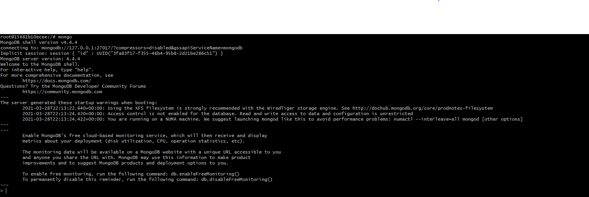

# :rainbow: Installation de Mongodb a partir de Docker 
------
## Dans un système de base de données relationnelles les données sont stockées par ligne dans des tables. Et il est souvent nécessaire de faire des jointures sur plusieurs tables afin de tirer des informations assez pertinentes de la base.
## Dans MongoDB, les données sont modélisées sous forme de document sous un style JSON.
## On ne parle plus de tables, ni d'enregistrements mais de collections et de documents. Ce système de gestion de données nous évite ainsi de faire des jointures de tables car toutes les informations propres à un certain donnée sont stockées dans un même document.
------
 # :rainbow:Les Etapes de l'intallation de Mongodb
# :one: Installation de Mongodb avec Docker 
```
docker run -d -p 27017:27017 --name mongodb mongo -v /data/db:/data/db

NB mongodb est le nom du container et V est le volume 
```

------
# :two:Nous allons entrer dans le container 

```
docker run --name mongodb -p 27017:27017 mongo

```


-----
# :three: Nous allons entrer dans Mongodb client

```
mongo
```

