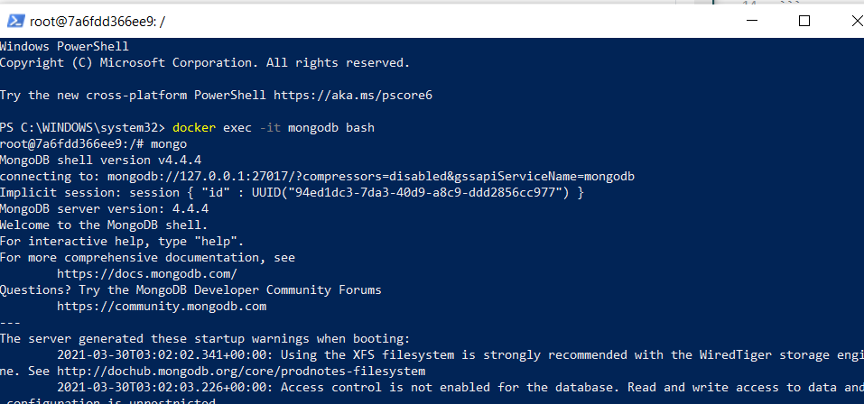

# :sea: Qu'est-ce que MongoDB ?
--------------
## MongoDB est une base de données orientée documents. En clair, vous bénéficiez de la scalabilité et de la flexibilité que vous voulez, avec les fonctions d’interrogation et d’indexation qu’il vous faut.
## MongoDB stocke les données dans des documents flexibles de type JSON , ce qui signifie que les champs peuvent varier d'un document à l'autre et que la structure des données peut être modifiée au fil du temp
## Le modèle de document mappe les objets de votre code d'application , ce qui facilite le traitement des données.
-----------

# :tiger: INSTALLATION 
# :zero: sur PowerShell 
```
Docker pull Mongo
```


------

# :one: Exécutions :car: 

```

docker run --name mongodb -p 27017:27017 mongo

```


--------------
# :two: UTILISATEURS 

```
docker exec -it mongodb bash
````


-----------


