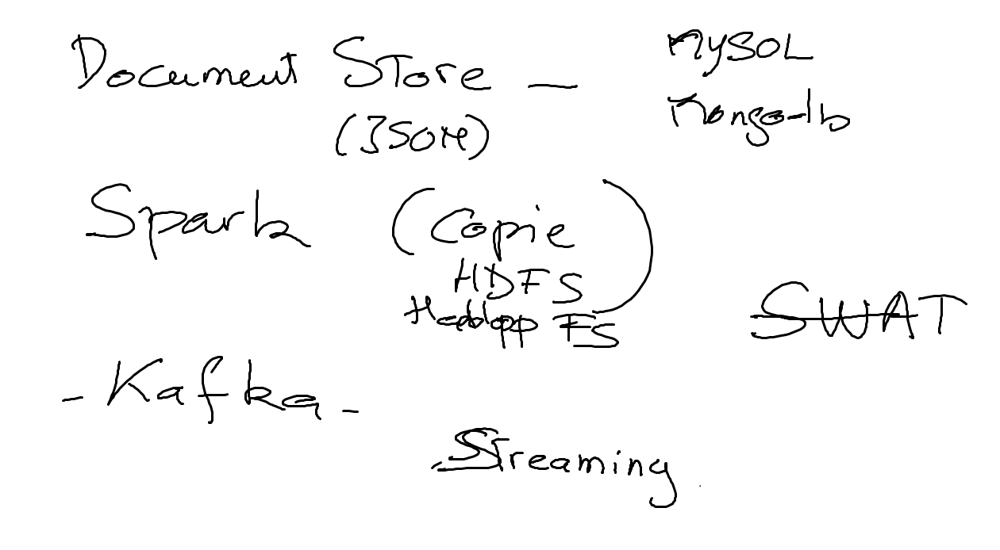

# INF1086-200-21H-02
Administration de base de données

```
Brice Robert is inviting you to a scheduled Zoom meeting.

Topic: CBCR  INF1086/201/1/Administration de base de données/21H
Time: This is a recurring meeting Meet anytime

Join Zoom Meeting
https://collegeboreal.zoom.us/j/82591048561?pwd=VGxRK20wTElpUE5aOXZ5djlwd2YyUT09

Password: yKXcQKHxoQ

One tap mobile
+17789072071,,82591048561# Canada
+12042727920,,82591048561# Canada

Dial by your location
        +1 778 907 2071 Canada
        +1 204 272 7920 Canada
        +1 438 809 7799 Canada
        +1 587 328 1099 Canada
        +1 647 374 4685 Canada
        +1 647 558 0588 Canada
        855 703 8985 Canada Toll-free
Meeting ID: 825 9104 8561
Find your local number: https://collegeboreal.zoom.us/u/kdIaQKj2Ag
```

## :date: [Épreuves](.epreuves)

## :one: [Devoirs](Devoirs)

|No| Date   | Cours              | Intitulé                            |  Pratique                                                     |
|--|--------|:-------------------|:------------------------------------|:--------------------------------------------------------------|
|01|01/02/21|[1.Kafka](1.Kafka)  | | | 
|02|28/02/21|[2.KSQL](2.KSQL)  | | | 


## Resultats d'Apprentissage du Cours

|No|L'etudiant(e) aura demontre, de facon fiable, sa capacite a:      |          Elements de performance                               | 
|--|------------------------------------------------------------------|:---------------------------------------------------------------| 
| 1| Administrer un système d’exploitation Windows Server dans des    | Savoir:                                                        | 
|  | environnements hôtes                                             | Savoir Faire:                                                  | 
|  |                                                                  | Savoir Etre:                                                   | 
| 2| Administrer des solutions infonuagiques privées avec             | Savoir:                                                        | 
|  | Hyper-V dans le but d’exécuter des systèmes                      | Savoir Faire:                                                  | 
|  | d’exploitation en tant qu’ordinateurs virtuels sur Windows       | Savoir Etre:                                                   | 


en respectant les normes standards de l’industrie.


## Déroulement de cours:

|# | Semaine|                                          |     Commentaires                                                   |
|--|:------:|:-----------------------------------------|:-------------------------------------------------------------------|
|01|11-01-21|                                          | Rentrée des classes                                                |
|02|18-01-21| Part 1                                   | MySQL - Document Store (JSON)                                      |
|03|25-01-21|                                          |                                                                    |
|04|01-02-21|                                          |                                                                    |
|05|08-02-21|                                          |                                                                    |
|06|15-02-21| Part 2                                   | Kafka                                                              |
|07|22-02-21|                                          |                                                                    |
|08|01-03-21| Semaine d'études                         | Pas de cours                                                       |
|09|08-03-21|                                          |                                                                    |
|10|15-03-21|                                          |                                                                    |
|11|22-03-21| Part 3                                   | Spark                                                              |
|12|29-03-21|                                          |                                                                    |
|13|05-04-21|                                          |                                                                    |
|14|12-04-21|                                          |                                                                    |
|15|19-04-21|                                          |                                                                    |

## Thêmes

 


https://www.linkedin.com/learning/learn-apache-kafka-for-beginners
