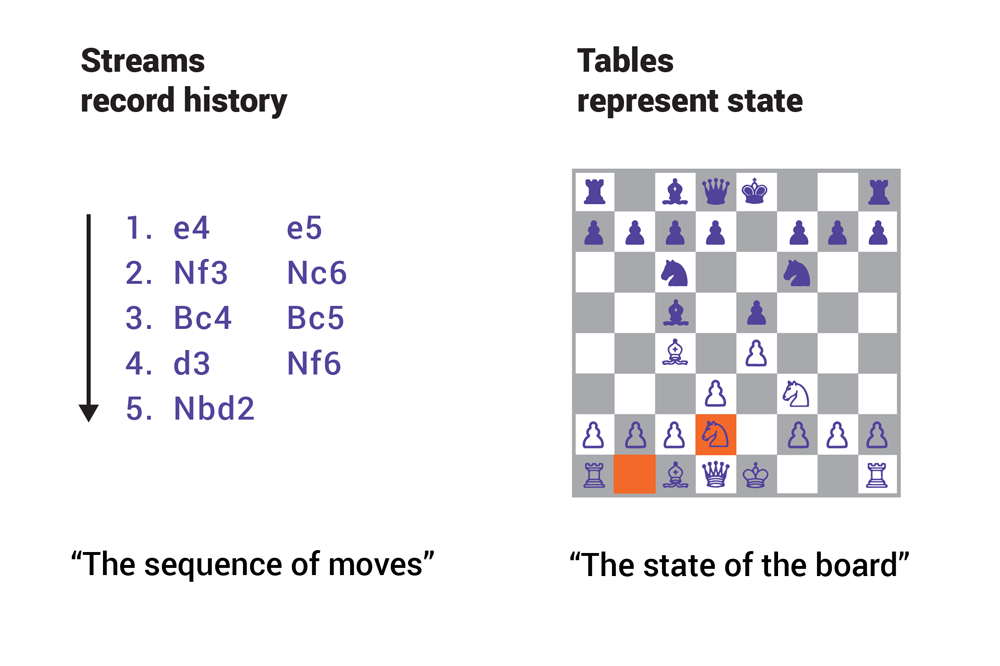

# KSQL

https://docs.ksqldb.io/

## Se connecter au CLI sous docker-compose 

* se connecter au container `ksql-cli`

```
$ docker-compose exec ksql-cli bash
```

* Éxécuter le CLI `ksql`

```
# ksql http://ksql-server:8088
```


## Topics

```
ksql> SHOW TOPICS;
```

```
ksql> PRINT 'topic-journald' FROM BEGINNING;
```

* example

```JSON
{
  "PRIORITY": "3",
  "SYSLOG_FACILITY": "4",
  "SYSLOG_IDENTIFIER": "sshd",
  "SYSLOG_PID": "691346",
  "SYSLOG_TIMESTAMP": "Jan 31 02:47:04 ",
  "_BOOT_ID": "71c1ad36d98a411580846ed8f5f7ff49",
  "_CAP_EFFECTIVE": "3fffffffff",
  "_COMM": "sshd",
  "_GID": "0",
  "_MACHINE_ID": "87307f42baa349d89a2a2686294d771d",
  "_PID": "691346",
  "_SELINUX_CONTEXT": "unconfined\n",
  "_SOURCE_REALTIME_TIMESTAMP": "1612061224076751",
  "_SYSTEMD_CGROUP": "/system.slice/ssh.service",
  "_SYSTEMD_INVOCATION_ID": "7996ad9bf85c48d79d229a341aba09cb",
  "_SYSTEMD_SLICE": "system.slice",
  "_SYSTEMD_UNIT": "ssh.service",
  "_TRANSPORT": "syslog",
  "_UID": "0",
  "__MONOTONIC_TIMESTAMP": "6433679966661",
  "__REALTIME_TIMESTAMP": "1612061224076793",
  "host": "ranomafana",
  "message": "error: kex_exchange_identification: read: Connection reset by peer",
  "source_type": "journald",
  "timestamp": "2021-01-31T02:47:04.076751Z"
}
```

:bulb: Date sous Unix i.e. [miliseconds](https://askubuntu.com/questions/783113/how-to-include-millisecond-in-syslogs)

```
$ date '+%Y-%m-%dT%H:%M:%S.%6N%:z'
2021-01-31T11:32:16.339052+00:00
```

```
$ date --rfc-3339=ns
2021-01-31 11:33:33.663636147+00:00
```

## Structure WITH

### Transformation de données WITH (VALUE_FORMAT)

- AVRO

- JSON
    * ( column TYPE, column TYPE, ... )
    * Type: BigInt, String, ...
    * [STRUCT](https://docs.confluent.io/current/ksql/docs/developer-guide/query-with-structured-data.html)

- DELIMITED
    * CSV
    

### Origine de données WITH (KAFKA_TOPIC)


### Nom des stream-table et de Topics

Par Convention, Utiliser `_`dans les noms de Streams et Tables: Note: ( `-` ne marche pas)

Par Convention, Utiliser `-`dans les noms de Topics


## :a: KSQL

## Commandes KSQL


```
ksql> SHOW TOPICS;
ksql> SHOW STREAMS;
ksql> SHOW TABLES;
```


## Reference:

https://docs.confluent.io/current/ksql/docs/tutorials/examples.html

https://aseigneurin.github.io/2018/08/22/kafka-tutorial-10-ksql.html

## :a: Streams

```
ksql> CREATE STREAM systemd (
    host string,
    timestamp VARCHAR
) WITH (
    kafka_topic = 'topic-journald',
    value_format = 'json',
    timestamp = 'timestamp',                        -- the column to use as a timestamp
    timestamp_format = 'yyyy-MM-dd''T''HH:mm:ss.nnnnnn''Z''' -- the format to parse the timestamp
);
```

```
ksql> SET 'auto.offset.reset' = 'earliest';
```

```
ksql> SELECT * FROM SYSTEMD EMIT CHANGES;
```

```
ksql> SET 'auto.offset.reset' = 'latest';
```

## Create Stream

</img>

* [CREATE STREAM stream_name](https://docs.confluent.io/current/ksql/docs/developer-guide/syntax-reference.html#create-stream)

* [CREATE STREAM stream_name AS SELECT](https://docs.confluent.io/current/ksql/docs/developer-guide/syntax-reference.html#create-stream-as-select)

* Create `Stream-Table`Join from Select

```
ksql> CREATE STREAM enriched_payments AS
           SELECT payment_id, u.country, total
           FROM payments_stream p
           LEFT JOIN users_table u
           ON p.user_id = u.user_id;
```

## Les requetes (SELECT)

* Une table simple (ROWTIME et ROWKEY)

```
ksql> SELECT * FROM ksql_products_table;

1553708750703 | 20225 | Long-Pants | 20225 | 75 | 1553708324
1553708754537 | 20227 | Dress-Pinky | 20227 | 89 | 1553708324
```


* Avec Structure

```
ksql> SELECT NAME, SKU,  \
       TICKET->PRICE,  \
       TIMESTAMPTOSTRING(TICKET->PRODUCT_DATE, 'yyyy-MM-dd HH:mm:ss')   \
       FROM ksql_products;


Scarf | 20223 | 25 | 2019-03-26 13:35:08
Braclet | 20224 | 35 | 2019-03-12 13:35:08
T-shirt | 20228 | 40 | 2019-03-16 13:35:08
```


## JOIN (ensure co-partitioning)

[Partition Data to Enable Joins](https://docs.confluent.io/current/ksql/docs/developer-guide/partition-data.html)

* ROWKEY

```
ksql> SELECT ROWTIME, ROWKEY, ID, FIRST_NAME, LAST_NAME FROM CUSTOMERS LIMIT 5;
1554920704559 | null | 1 | Bibby | Argabrite
1554920700660 | null | 3 | Marv | Dalrymple
1554920698753 | null | 7 | Marigold | Veld
1554920696742 | null | 8 | Ruperto | Matteotti
1554920702601 | null | 5 | Modestia | Coltart
```

* WITH (PARTITIONS): Partitions égales

```
ksql> CREATE STREAM CUSTOMERS_REKEY WITH (PARTITIONS=6) AS SELECT * FROM CUSTOMERS PARTITION BY LAST_NAME;
```

* [Inspecter les clés](https://www.confluent.io/stream-processing-cookbook/ksql-recipes/inspecting-changing-topic-keys)

```
ksql> DESCRIBE EXTENDED CUSTOMERS_REKEY;

Type                 : STREAM
Key field            : LAST_NAME
[...]
```

* Montrer les clés dans une requete

```
ksql> SELECT ROWKEY, ID, FIRST_NAME, LAST_NAME FROM CUSTOMERS_REKEY LIMIT 5;
Yeeles | 4 | Nolana | Yeeles
Dalrymple | 3 | Marv | Dalrymple
Coltart | 5 | Modestia | Coltart
Acaster | 6 | Bram | Acaster
Argabrite | 1 | Bibby | Argabrite
```

## Create Table

* [CREATE TABLE table_name](https://docs.confluent.io/current/ksql/docs/developer-guide/syntax-reference.html#create-table)

* Créer un stream avec clé

```
ksql> CREATE STREAM products_with_key \
         WITH (VALUE_FORMAT='AVRO', KAFKA_TOPIC='products-with-key') \
         AS SELECT NAME, CAST(SKU AS STRING) AS ID, TICKET->PRICE, TICKET->PRODUCT_DATE \
         FROM ksql_products PARTITION BY ID;
         
 
 Message
----------------------------
 Stream created and running
```

* Crée la table d'après le topic `products-with-key` et spécifier la clé `KEY`:
```
ksql> CREATE TABLE ksql_products_table \
      WITH (VALUE_FORMAT='AVRO', \
      KAFKA_TOPIC='products-with-key', KEY='ID');
      
      
  Message
---------------
 Table created
---------------
```

* [CREATE TABLE table_name AS SELECT](https://docs.confluent.io/current/ksql/docs/developer-guide/syntax-reference.html#create-table-as-select)


## Play whith running Queries

* Montrer les Requetes en cours

```
ksql> SHOW QUERIES;

 Query ID              | Kafka Topic    | Query String                                                                                                                                                                                                                                          
------------------------------------------------------------------------------------------------------------------------------------------------------------------------------------------------------------------------------------------------------------------------------------------------
 CSAS_PRODUCTS_WITH_KEY_1 | PRODUCTS_WITH_KEY | CREATE STREAM products_with_key    WITH (VALUE_FORMAT='AVRO',     KAFKA_TOPIC='repas_with_key') 
------------------------------------------------------------------------------------------------------------------------------------------------------------------------------------------------------------------------------------------------------------------------------------------------
For detailed information on a Query run: EXPLAIN <Query ID>;
```

* Stopper une requete

```
ksql> terminate  CSAS_PRODUCTS_WITH_KEY_1;

 Message           
-------------------
 Query terminated. 
-------------------
```

## Drop Stream/Table

* Détruire un stream

```
ksql> drop stream products_with_key;

 Message                             
-------------------------------------
 Source PRODUCTS_WITH_KEY was dropped.  
-------------------------------------
```

* Détruire une tables

```
ksql> drop table products;

 Message                         
---------------------------------
 Source PRODUCTS was dropped.  
---------------------------------
```

---


## Reference:

https://docs.confluent.io/current/ksql/docs/developer-guide/syntax-reference.html

https://docs.confluent.io/current/ksql/docs/troubleshoot-ksql.html

[KSQL shows no data for a query against TABLE if the source messages are not keyed.](https://github.com/confluentinc/ksql/issues/1405)

https://www.confluent.io/blog/kafka-streams-tables-part-1-event-streaming/

## Lecture:


[KSQL – The Open Source SQL Streaming Engine for Apache Kafka by Kai Wähner](https://www.youtube.com/watch?v=nA-ZKsXNJCQ)

[Distributed stream processing for everyone with KSQL by Michael Noll](./big_data_fast_data_easy_data_-_distributed_stream_processing_for_everyone_with_ksql_-_michael_noll_-_berlin_buzzwords_2018.pdf)
